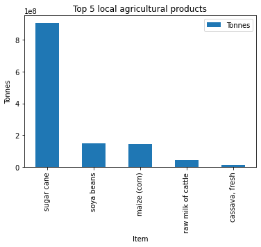
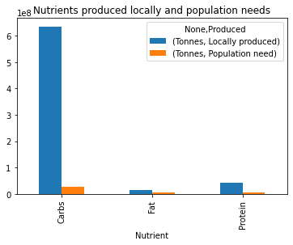
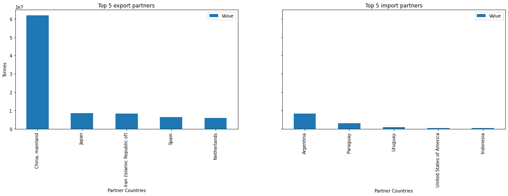
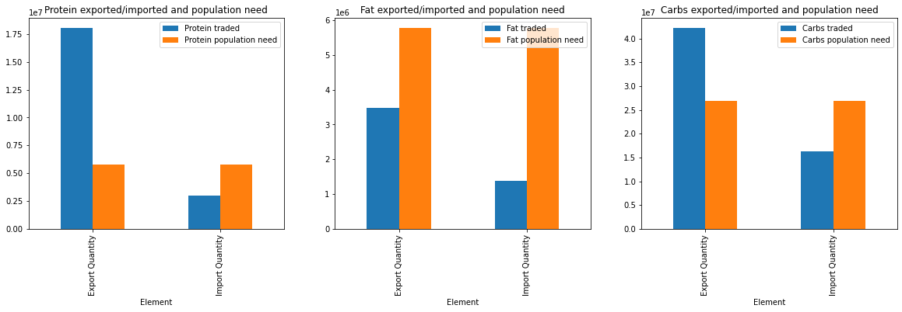
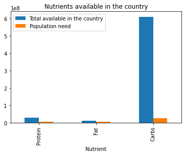

# UN Big data hackaton 2022
Part of the notebooks presented at the UN Big Data Hackaton 2022. This analysis was awarded best in Oceania

## Explorative Analysis of Agricultural production based on nutrients
The analysis started by finding the nutritional values of different agricultural products. The data
used was extracted from the U.S Department of Agriculture ([FoodData Central (usda.gov)](https://fdc.nal.usda.gov/)). The
data contains the amount of nutrients including but not limited to protein, fat and carbohydrates.
The calculations for nutrients includes the weight of the agricultural product from where the
sample was taken. The calculation followed the following formula:

```Agricultural product (Tonnes) * Nutrients (grams) / Sample weight (grams)```

The agricultural data was extracted from the Food and Agriculture Organization of the United
Nations. There are several datasets used to describe the amount of nutrients a country is
producing. First, the total production of agricultural products was estimated in 1000 USD units,
which is inconvenient to calculate the amount of nutrients of the production. Consequently, we
used the local price in USD/Tonnes. Using these two values, we estimated the total amount of
tonnes produced in the country.

Next, we considered the population needs, based on the assumption that 500g is needed per
day per person. The breakdown of this 500g was that 15% needed to protein, 15% needed to
be fat and the remaining 70% needed to be carbohydrates as discussed earlier in the report.



Figure 1: Top 5 local agricultural products produced

Figure 1 represents how many tonnes are produced by the top 5 agricultural products.
Something to highlight is that the biggest local agriculture product produce is sugar cane which
has low nutrients (0g protein, 0.3g fat and 99g carbs). As a result, Figure 2 highlights that Brazil
has a massive production of carbohydrates compared to fat and proteins.



Figure 2: Nutrients locally produced and the population needs

Additionally, we used a trade matrix to find import and export of agricultural products to the
country of analysis. Figure 3 shows that Brazil relies heavily in exports, specially with China. In
terms of imports the biggest partner country is Argentina and Paraguay that are two
neighbouring countries.



Figure 3: Top 5 import and export partners

The total amount of tonnes and the specific nutrients of the agricultural product were used to
estimate the total amount of nutrients available in the country. Figure 4 shows that even having
a low production of protein, Brazil protein exports are very high being only half of the
carbohydrates.



Figure 4: Export and import nutrients and the population need

Having the knowledge of imports, export and locally produce agricultural products is not enough
to have a clear picture of the country available nutrients. Consequently, it was used the following
formula to describe the nutrients available in the country:

```Local nutrient produce (Tonnes) - Nutrient exports (Tonnes) + Nutrient imports (Tonnes)```



Figure 5: Nutrients available in the country considering local produce, exports and imports

Figure 5 describes that the amount of nutrients to feed the Brazilian population is more than
enough. However, according to the UN data, Brazil has a 5.4 million people (2.5% of the
population) as of 2019 undernourished.

Brazil is a specific case that can potentially have little problems in terms of food insecurity due
to supply of conflict challenges as it has a strong agricultural produce. However, as depicted in
Figure 5, the access to food is one of the most critical problems and as Brazil relies heavily on
exports, a trade problem can suggest less income to the country incrementing the access to
food. In the Brazilian scenario, food production is not a problem but rather access to food
